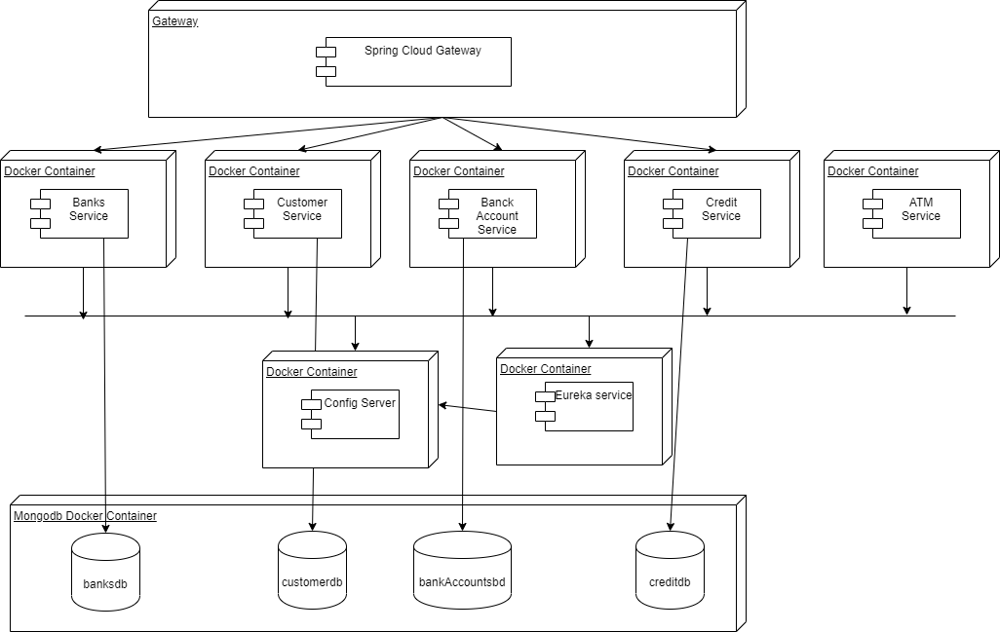

# Everis Project 4 updated - Customers

Java Spring Boot Backend connected to mongodb.

### Command for run Dockerfile and start container
cd /customers

docker build -t "customers"

docker run --restart always --name customers -8080:9000 -d customers:latest

### Using Docker Compose
cd /customers

docker-compose up -d

### Sonarqube
docker run -d --name sonarqube -p 8090:9000 sonarqube

## Arquitectura de Microservicio

